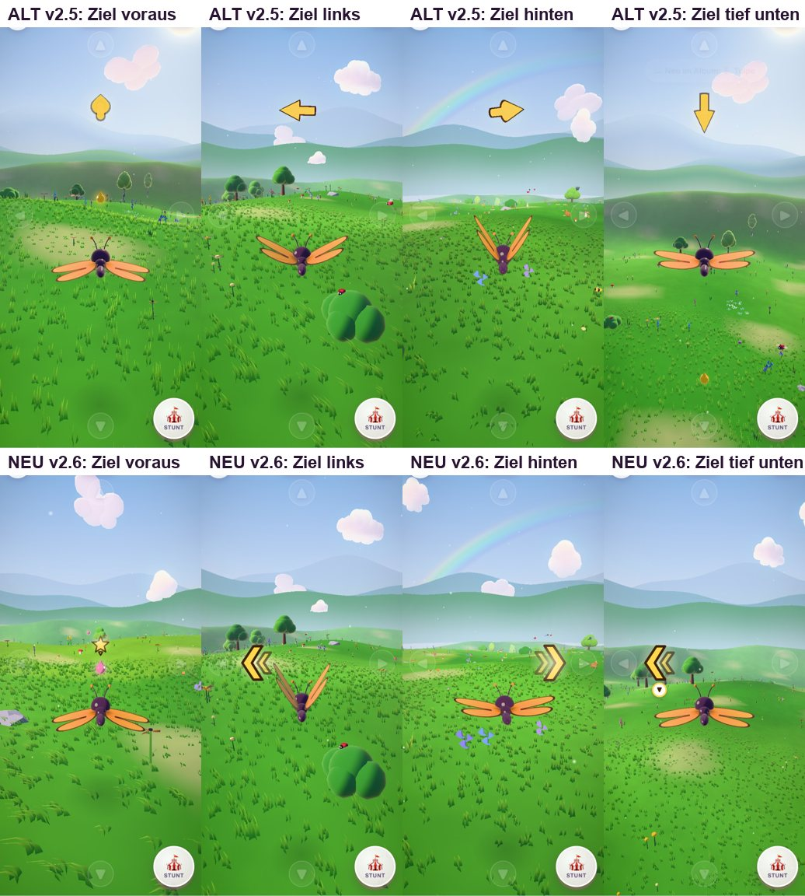

# Schmetterlingswiese 2.6 – neue Zielanzeige: Stern über dem Ziel statt Pfeil am Himmel

Stand: 04.10.2026 · Branch `main` · Live: https://drpeterkalmar.github.io/schmetterlingswiese/ (Version 2.6.0)

Wunsch (03.10.): „Pfeil der Schmetterlingswiese ist irgendwie verwirrend, weil er nach oben und unten zeigt. Anderes
Pfeildesign?“

> **Teil 1 auf rog17 gebaut:** Die Zielanzeige selbst, der Test und die Bilder entstanden am 04.10. auf dem
> Windows-Laptop (rog17). Der Lauf wurde wegen des lauten Lüfters gestoppt. Übernahme, komplette Testrunde, Bildprüfung,
> Bericht und Veröffentlichung liefen danach auf dem Mac.

## Bitte am Handy testen

- **Neu (Standard):** https://drpeterkalmar.github.io/schmetterlingswiese/
- **Zum Vergleich der alte Pfeil (v2.5):** https://drpeterkalmar.github.io/schmetterlingswiese/?ziel=pfeil
- Worauf achten: Ein Level auf 🌱 Leicht spielen (z. B. 1-1 Tropfen, 4-3 Ringe) und fragen: Weiß das Kind ohne
  Erklärung, wohin es fliegen soll? Hält es ▲ gedrückt, nur weil das Ziel geradeaus liegt? (Das soll nicht mehr passieren.)
- Auf 🔥 Schwer gibt es wie bisher keine Zielanzeige.

## Was sich ändert

Der alte 3D-Pfeil zeigte bei einem Ziel geradeaus im Bild nach **oben**. Auf dem Handy heißt „oben“ aber „steigen“.
Darum trennt v2.6 „**wo** ist das Ziel“ von „**wohin** lenken“:

| Lage des Ziels | Anzeige |
|---|---|
| im Bild | goldener Stern mit kleinem Zipfel nach unten, schwebt direkt über dem Ziel (zeigt **auf** das Ziel) |
| links/rechts außerhalb oder hinter der Figur | gelber Doppel-Randpfeil « bzw. » neben ◀ / ▶ = „dorthin drehen“ |
| deutlich höher/tiefer (≥ 3 m) und nicht gut im Bild | zusätzlich ein kleines ▲/▼-Abzeichen = steigen/sinken |
| ganz nah (unter 6–9 m) | blendet weich aus |

- Ziel genau hinten: Der Randpfeil bleibt auf einer Seite und springt beim Drehen nicht hin und her (Hysterese ≈ 29°).
- Der Stern weicht der Figur nach oben aus, wenn sie im Weg ist, und verdeckt nie Kopfleiste, ▲/▼-Hilfe, Meldungen
  oder den Joystick.
- Alle Einstellwerte stehen in einem Objekt `GUIDE` (`js/game/game.js`).

## Vorher / Nachher

Quer: `tests/shots/v26/vergleich_quer.jpg` · alle 5 Welten: `tests/shots/v26/ziel_welten_hoch.jpg` / `_quer.jpg` ·
Einzelfälle `tests/shots/v26/ziel_<fall>_<hoch|quer>.jpg`.

**Bildprüfung (selbst angesehen):**
- Ziel voraus: Statt eines Pfeils nach oben schwebt der Stern über dem Tropfen bzw. sitzt oben auf dem Ring. Nichts
  im Bild sagt „steigen“.
- Ziel links/hinten: Der Doppelpfeil sitzt neben der Lenkzone ◀ bzw. ▶ und sagt nur „hierhin drehen“.
- Ziel tief unten/hoch oben voraus: Der Stern steht am unteren bzw. oberen Bildrand mit ▼/▲. Hier stimmt „sinken/steigen“
  wirklich.
- In allen 5 Welten (auch Teich und Abendhimmel) ist der Stern deutlich zu sehen.
- Grenzen: Aus 24 m Entfernung ist der Stern klein (44 px hoch, 38 px quer). Das ▲/▼-Abzeichen ist bewusst klein und
  wird von Kindern wohl erst später bemerkt. Ob ein 6-jähriges Kind das sofort versteht, zeigt nur der Handytest.

## Belege (Mac, GPU-WebGL)

- `sw.js`: Auf dem Mac entsteht dieselbe Datei wie auf dem Windows-Laptop (Version `fe8b0c2faf`, kein Unterschied).
- Grundtest (`smoke.py`): **0 Fehler**.
- `test_v26_ziel` (ersetzt `test_v25_pfeil`), hoch 412×915 und quer 915×412, **alle Fälle grün**:
  - Ziel voraus in allen 5 Welten: Stern genau mittig über dem Ziel (Abweichung 0 px), Spitze zeigt nach unten,
    verdeckt die Figur nicht.
  - Links/rechts: richtige Seite. Hinten: 0 Seitenwechsel in 3 s Drehung.
  - Tief/hoch: ▼/▲-Abzeichen. Nah: ausgeblendet. Schwer: nichts zu sehen. Toast und Joystick bleiben frei.
- Ganze Suite `tests/run_all.sh` (21 Teile), **alle grün**: Level (alle 15 + Tagesaufgabe), Sieger-Einlagen, Stunts,
  Wettflug, Tiere, Landen, Fang, Schmuck, Magnet, Glitzer, UI, Werkstatt, PWA/offline, Audio, Fluggeräusch, Anatomie,
  Speicherlecks, Leistung, Bildzeiten.
- Leistung: 60 fps, CPU pro Bild 0,61–0,65 ms (v2.5: 0,70–0,85 ms), also nicht schlechter.
